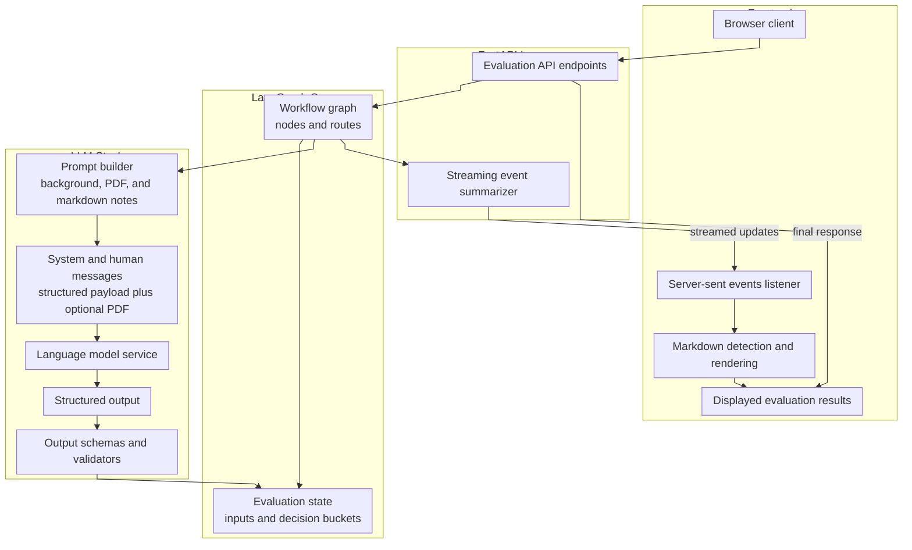

# LangGraph Overview

```mermaid
%%{init: {'flowchart': {'nodeSpacing': 12, 'rankSpacing': 14, 'padding': 8, 'curve': 'linear'}}}%%
flowchart TB
  subgraph Frontend["Frontend"]
    direction TB
    Client["Browser client"]
    SSE["Server-sent events listener"]
    Markdown["Markdown detection and rendering"]
    Results["Displayed evaluation results"]
    SSE --> Markdown --> Results
  end

  subgraph API["FastAPI Layer"]
    direction TB
    Endpoints["Evaluation API endpoints"]
    StreamEvents["Streaming event summarizer"]
  end

  subgraph Core["LangGraph Core"]
    direction TB
    Graph["Workflow graph\nnodes and routes"]
    State["Evaluation state\ninputs and decision buckets"]
    Graph --> State
  end

  subgraph LLMStack["LLM Stack"]
    direction TB
    Prompting["Prompt builder\nbackground, PDF, and markdown notes"]
    Messages["System and human messages\nstructured payload plus optional PDF"]
    Model["Language model service"]
    Structured["Structured output"]
    Schemas["Output schemas and validators"]
    Prompting --> Messages --> Model --> Structured --> Schemas
  end

  Client --> Endpoints
  Endpoints --> Graph
  Graph --> Prompting
  Schemas --> State

  Graph --> StreamEvents -->|streamed updates| SSE
  Endpoints -->|final response| Results
```
